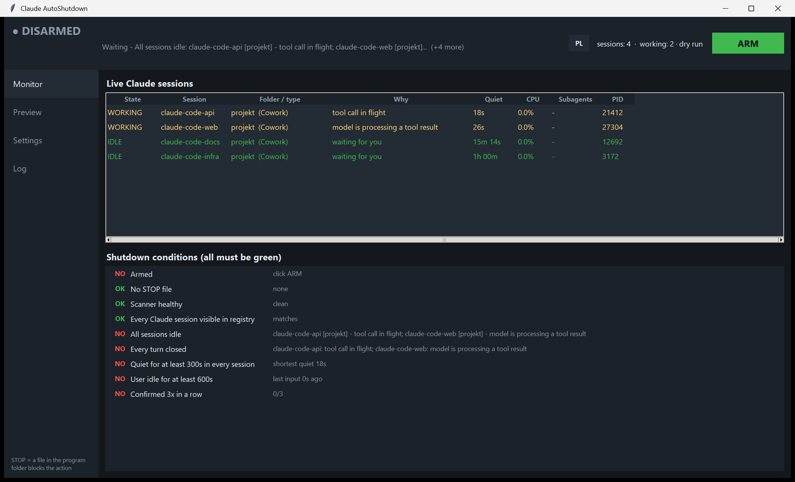

# Claude AutoShutdown — shut down Windows only after every Claude Code session has really finished

Leave your AI agents running overnight and let the machine turn itself off — but only once
**every** Claude Code / Cowork session, including its subagents, has genuinely stopped working.

A small Windows desktop app (Python + Tkinter, **no third-party runtime dependencies**) that
watches Claude Code sessions and triggers shutdown, hibernate, sleep or lock when they are all
idle. Built for unattended overnight agent runs.

[](https://www.python.org/)
[](#requirements)
[](#tests)
[](#requirements)
[](LICENSE)



> The UI is currently in Polish. The screenshot above reads: *Live Claude sessions* — state
> (WORKING / IDLE), session, directory, **why**, silence, CPU, subagents, PID — and below,
> *Shutdown conditions (all must be green)*. English localisation is not done yet; PRs welcome.

---

## The problem

You start a long agent run, go to sleep, and want the PC off when it's done. Every naive
approach gets this wrong in a way that either **kills work in progress** or **never fires at all**:

| Naive signal | Why it fails |
|---|---|
| "No CPU usage" | An idle Claude Code session and a working one occupy the *same* CPU range — measured below |
| "Log file hasn't changed in N minutes" | During `/compact` or an API rate-limit wait the transcript is frozen for minutes while the agent is very much alive |
| "The process exited" | Sessions stay resident between turns; the process living tells you nothing |
| "Window title / focus" | Says nothing about background subagents |

Getting it wrong at 3 AM means an agent loses an hour of work mid-edit. This tool is built
around one rule: **not knowing is never permission to shut down.**

---

## How it decides a session is finished

It reads the same on-disk state Claude Code writes, rather than guessing from system metrics:

| Source | What it gives |
|---|---|
| `~/.claude/sessions/<PID>.json` | registry of live sessions: PID, session id, cwd, `procStart`, name |
| `~/.claude/projects/<slug>/<sessionId>.jsonl` | transcript — `mtime` advances on every write |
| `.../<sessionId>/subagents/**/*.jsonl` | subagents, **including Workflow fan-outs in nested folders** |
| last transcript record | **turn state** — the single most important signal |

### Turn state beats file silence

| Record | State | Meaning |
|---|---|---|
| `assistant` + `stop_reason: end_turn` | **CLOSED** | model answered, waiting for a human |
| `assistant` + `stop_reason: tool_use` | **OPEN** | tool call in flight |
| `user` (tool result or prompt) | **OPEN** | model is thinking / compacting / waiting on a rate limit |
| `isCompactSummary` | **OPEN** | context compaction in progress |
| anything else | **UNKNOWN** | **blocks shutdown** |

A session counts as idle only when its turn is closed **and** the transcript has been quiet
longer than the threshold **and** no subagent has written recently.

### Two failure modes that had to be engineered around

Both were found by an adversarial audit against real transcripts, not imagined:

- **The tail read window is adaptive.** A single JSONL record can be larger than the whole tail.
  On the development machine there were **494 records over 256 KB, the largest 5.1 MB** — almost
  all of them `user` records carrying tool results, i.e. exactly the "model just got a result and
  is still working" moment. With a fixed window the tail contained *no complete line at all*, and
  the session read as UNKNOWN. The reader now starts at 256 KB and grows (up to 16 MB) until it
  finds a conversation record.
- **An allow-list, not a noise-list.** Only `assistant` and `user` records decide turn state.
  Real transcripts also contain `frame-link` (946 occurrences), `pr-link` (155), `artifact-*` (30)
  and `permission-mode` — record types added *after* this program was written. With a noise-list,
  every new record type would silently erase a detected open turn.

### Why CPU usage is ignored

Measured on the development machine (6 samples, 5 s apart): sessions with a **closed** turn ran
at 0.9–2.0 % with peaks to **5.0 %**; a session actually working ran at 2.7 % peaking at 5.3 %.
The distributions overlap, so CPU carries no information. It stays as a column in the monitor —
to look at, not to decide with. At the original 3 % threshold every idle session falsely reported
"working" and the machine would never have shut down.

### Dead sessions

A session file survives its process. Stale entries are rejected in two steps: the PID must be
alive **and** the process start time must match `procStart` from the file (1 s tolerance). That
defeats Windows PID recycling.

---

## Safety — fourteen independent gates

Shutting down a machine is irreversible enough to deserve paranoia.

1. **Always starts disarmed.** Armed state is never inherited from the config file.
2. Arming requires a click and a confirmation listing every rule that will apply.
3. Every condition must be green **N polls in a row** (default 3). One flicker resets the counter.
4. **Countdown** (default 90 s) with a large CANCEL and `Esc`. Any session returning to work
   aborts it automatically. The "Execute now" button refuses keyboard focus, so a stray space bar
   cancels — never accelerates.
5. Requires the user to be idle (default 10 minutes without mouse or keyboard).
6. A **`STOP` file** in the program directory blocks the action unconditionally.
7. **Guard processes** — while a process matching your pattern lives (e.g. `ffmpeg`), nothing happens.
8. **Single instance** — a second copy detects the first (PID + process start time) and exits
   instead of running the action twice. A lock file left by a crash blocks nothing.
9. **Scanner failure blocks.** "I can't see anything" does not mean "nothing is running".
10. **Cross-check against the OS process list** — a live Claude Code process with no registry entry
    blocks shutdown. Desktop-app helper processes (renderer, GPU, crashpad) are filtered out by path.
11. **The last session disappearing still requires silence** — closing your last Claude window
    doesn't kill the machine 30 seconds later.
12. **Disarming aborts a running countdown**, and the executor re-checks armed state, the `STOP`
    file and scanner freshness immediately before acting.
13. **The watchdog watches itself.** The GUI loop cannot die silently on an exception, and if the
    scanner stops delivering data the header switches to `MONITOR SILENT` / `MONITOR DEAD`.
14. Every decision is logged, **including why it is still waiting** — the log records each change
    in the set of blockers, so "why is the machine still on this morning" has an answer.

---

## No dialogs — neither UAC nor "an app is preventing shutdown"

The program must turn the machine off with nobody at the keyboard, so no step may wait for a click.

- **No UAC prompt.** Shutting down your own machine needs only `SeShutdownPrivilege`, which a
  normal account has — not administrator rights. Verified: `shutdown /s /t 600` returned **exit 0**
  from a non-elevated account (then immediately aborted). The app self-checks this privilege on
  startup and **refuses to arm** if the chosen action isn't available, rather than promising
  something it can't deliver.
- **No blocking screen.** Without `/f`, Windows can display "This app is preventing shutdown" and
  wait. The shutdown action uses `shutdown /s /t 0 /f`. The cost: unsaved work in other programs is
  lost. Switchable off in Settings.
- **Silent failure is detected.** The exit code is checked. If `shutdown.exe` rejects the command,
  the app logs `ACTION FAILED` with the full message, disarms and shows an error — instead of
  reporting success and leaving the machine on.

---

## Requirements

- **Windows** (uses Win32 APIs through `ctypes`: process times, `GetLastInputInfo`, token privileges)
- **Python 3.14** — developed and tested on 3.14.2 / 3.14.3
- **No third-party runtime dependencies.** Standard library only: `ctypes`, `tkinter`, `json`,
  `subprocess`, `pathlib`, `threading`, `queue`. `pytest` is needed only to run the test suite.
- Claude Code writing its usual state under `~/.claude` (override with `CLAUDE_CONFIG_DIR`)

## Install

```bash
git clone https://github.com/kamiljan11/claude-autoshutdown.git
cd claude-autoshutdown
python -m pytest -q          # optional: 105 tests
```

Start it with **`Claude AutoShutdown.vbs`** (no console window), or
`Uruchom z konsola (diagnostyka).bat` when you want to see tracebacks.

**Autostart:** put a shortcut to the `.vbs` in your Startup folder:

```powershell
$s = (New-Object -ComObject WScript.Shell).CreateShortcut(
  (Join-Path ([Environment]::GetFolderPath('Startup')) 'Claude AutoShutdown.lnk'))
$s.TargetPath = 'wscript.exe'
$s.Arguments  = '"C:\path\to\claude-autoshutdown\Claude AutoShutdown.vbs"'
$s.Save()
```

It starts **disarmed and in dry-run mode**. To make it actually shut down, untick "Tryb prób"
(dry run) in Settings and click UZBRÓJ (arm).

## Configuration

`config.json` next to the program (see [`config.example.json`](config.example.json)):

| Key | Default | Meaning |
|---|---|---|
| `quiet_seconds` | 300 | silence per session before it counts as finished |
| `poll_seconds` | 10 | scan interval |
| `required_polls` | 3 | consecutive clean cycles required |
| `countdown_seconds` | 90 | time to cancel |
| `human_idle_required` | 600 | seconds without mouse/keyboard |
| `action` | `shutdown` | `shutdown` / `hibernate` / `sleep` / `lock` / `nothing` |
| `force_close_apps` | `true` | append `/f` so Windows shows no blocking screen |
| `arm_on_start` | `false` | arm automatically at launch (no clicking after a reboot) |
| `dry_run` | `true` | **turn off to actually shut down** |
| `guard_patterns` | `[]` | substring / glob / regex process names that block shutdown |

The state directory (config, log, `STOP` file) can be moved with `CLAUDE_AUTOSHUTDOWN_HOME`.

## Tests

```bash
python -m pytest -q      # 105 unit tests
python ultimate_test.py  # 13-stage end-to-end run
```

`ultimate_test.py` builds a **synthetic** `~/.claude` in a temp directory, spawns real processes
named `claude.exe`, and drives the program through 13 stages — open turn, context compaction, two
sessions, everything finished, dead PID, a record larger than the read window, an unknown record
type, scanner failure, a session missing from the registry, the last session disappearing, and a
full GUI end-to-end run in live mode with the action set to `nothing`. It never touches the real
machine.

## How this was built

After the first working version, the code was put through a five-round adversarial audit: 146
agents raised 131 findings, of which **89 were confirmed** by a skeptic pass that had to reproduce
each one against real data (8 critical, 24 high, 37 medium, 20 low). Every critical and high
finding is fixed. The full anonymised finding list is in
[`docs/audit-findings.json`](docs/audit-findings.json) — including the ones that would have shut
the machine down mid-run.

## Limitations

- A session waiting for **your** answer to a permission prompt has an open turn, so it blocks
  shutdown. Intentional — but a pending approval keeps the machine on.
- The program knows nothing about work **outside** Claude Code: a running `git push`, a render, an
  upload. Use `guard_patterns` for those.
- `sleep` on a machine with hibernation enabled usually hibernates — that's Windows behaviour.
- UI strings are Polish. The logic and this document are language-independent.

## Keywords

Claude Code auto shutdown · shut down Windows PC when AI agents finish · unattended overnight
agent runs · Claude Code session monitor · AI coding agent idle detection · Windows power
automation · Tkinter desktop utility · agent transcript turn state · subagent activity monitor

## License

[MIT](LICENSE)

---

🇵🇱 Polska wersja dokumentacji: [README.pl.md](README.pl.md)
