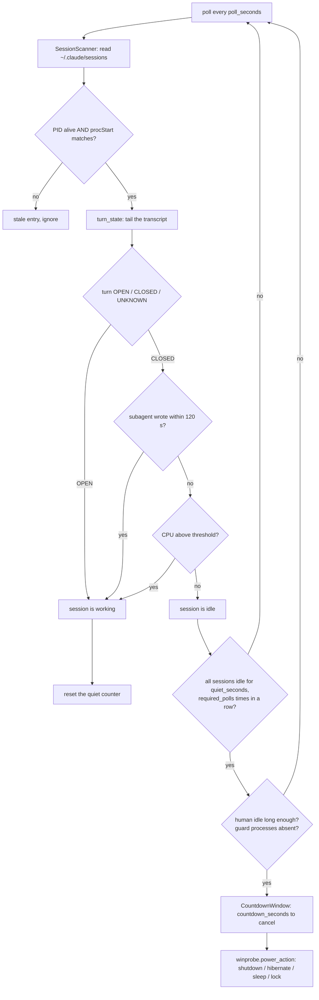

# Architecture

One page for someone who has never seen this repository. Read it before changing anything —
the two non-obvious decisions are in [`docs/adr/`](adr/) and both exist because the naive
version of them shut a machine down mid-run.

## What the program has to get right

Windows must go to sleep **only** when every Claude Code / Cowork session — including the
subagents a session spawns — has genuinely stopped working. Every mistake is expensive in one
of two directions: shutting down too early kills an unattended overnight run, and never
shutting down defeats the entire point of the tool. There is no "roughly right" here.

## Modules

| File | Responsibility | Depends on |
|---|---|---|
| `autoshutdown.py` | Tkinter UI, config load/validate/save, single-instance lock, log rotation, `MonitorThread`, `CountdownWindow` (the cancellable countdown before the power action) | `monitor`, `i18n`, `winprobe` |
| `monitor.py` | The engine. Scans live sessions, classifies each turn, produces a `Verdict` (`evaluate()`). Contains no UI code and no power actions | `winprobe`, `i18n` |
| `winprobe.py` | The only place that touches Win32, via `ctypes` — process probe (alive / exe / start time / CPU), human idle time, power action | stdlib only |
| `i18n.py` | UI strings in English and Polish; language follows the Windows display language, switchable in the header | stdlib only |
| `build_exe.py`, `make_icon.py` | Build a standalone `.exe` (PyInstaller, one file, no console) and generate the icon without an image library | stdlib + PyInstaller (build time only) |
| `Claude AutoShutdown.vbs` | Launcher that starts the app without a console window | — |

Runtime dependencies: **none**. Python 3.14 standard library plus `ctypes`. PyInstaller is a
build-time tool, not a runtime dependency, and Tkinter ships with CPython on Windows.

## Where the truth about a session comes from

Claude Code leaves three kinds of files under `~/.claude`, and the engine reads all three:

```
~/.claude/sessions/<PID>.json                              registry: pid, sessionId, cwd,
                                                           procStart (FILETIME), entrypoint, name
~/.claude/projects/<slug>/<sessionId>.jsonl                transcript; mtime moves on every write
~/.claude/projects/<slug>/<sessionId>/subagents/*.jsonl    parallel subagents of that session
```

A session file survives the process that wrote it, so every entry is verified twice: the PID
must still be alive **and** the process start time must match `procStart` within one second.
Without the second check, a recycled PID looks like a live session forever.

## The decision flow



`dry_run` (default `true` in `config.example.json`) runs the whole flow and logs the verdict
without touching power state. Turn it off deliberately, after you have watched it decide
correctly on your own machine.

## Configuration

`config.example.json` is the documented shape; the app writes its own `config.json` next to
the executable. Every value is validated on load (`validate_config`) and a bad value produces
a warning plus the default, never a crash. The knobs that change behaviour most:

- `quiet_seconds` + `required_polls` — how long, and across how many consecutive polls, all
  sessions must look idle.
- `require_human_idle` / `human_idle_required` — do not shut down while a person is typing.
- `guard_patterns` — process names that block the action entirely (a render, a backup, a build).
- `action` — `shutdown` | `hibernate` | `sleep` | `lock`.

## Tests

`python -m pytest -q` → **158 passed** (parametrised cases included; 112 test functions across
`test_monitor.py`, `test_hardening.py`, `test_app.py`, `test_winprobe.py`), run by
`.github/workflows/quality.yml` on every push together with the
linter and a synthetic end-to-end run. The engine is written so that it can be tested without a
live Claude session: `SessionScanner` and `evaluate()` take paths and clock values as inputs, so
the whole decision path runs against fixture directories.

## Boundaries

- Windows only, on purpose: `winprobe.py` is `ctypes.wintypes` all the way down. A port would
  mean a second backend behind the same three functions, not changes elsewhere.
- The engine never performs the power action itself; it returns a verdict. The UI decides,
  shows the countdown and calls `winprobe.power_action`. Keep that split — it is what makes
  `dry_run` and the tests possible.
